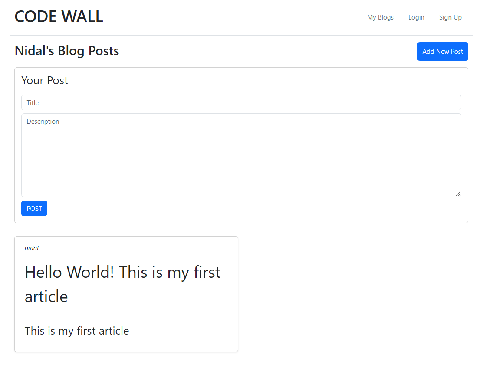

# Atelier 2 : Javascript et POO

Dans ce rapport, nous présenterons les solutions aux exercices pratiques en JavaScript proposés lors de l'atelier. Chaque section correspond à un exercice spécifique suivie de notre solution pour le résoudre.

## Exercice 1

#### Problème :

**1** - Écrire une fonction constructeur voiture avec les attributs « modèle, marque, année, type, carburant ».

**2** - Créer une liste des voitures.

**3** - Implémenter le mécanisme d’héritage entre la classe voiture et deux autres classes Hyundai (attributs : série (chaîne de caractères), hybride (booléen) / méthodes : alarmer()) et Ford (options (tableau)).

**4** - Trier puis afficher les voitures selon un ordre croissant des années.

#### Solution :


```javascript
// Fonctions Constructeurs
function voiture(model, marque, annee, type, carburant) {
    this.model = model; // Modèle de la voiture
    this.marque = marque; // Marque de la voiture
    this.annee = annee; // Année de fabrication de la voiture
    this.type = type; // Type de la voiture
    this.carburant = carburant; // Type de carburant de la voiture
}

function Hyndai(model, marque, annee, type, carburant, serie, hybride) {
    voiture.call(this, model, marque, annee, type, carburant);
    this.serie = serie; // Série de la voiture Hyundai
    this.hybride = hybride; // Indicateur si la voiture est hybride ou non
}

function Ford(model, marque, annee, type, carburant, options) {
    voiture.call(this, model, marque, annee, type, carburant);
    this.options = options; // Options disponibles pour la voiture Ford
}

// Ajout des méthodes et héritage
voiture.prototype.getModel = function () {
    return this.model; // Renvoie le modèle de la voiture
};

voiture.prototype.getAnnee = function () {
    return this.annee; // Renvoie l'année de fabrication de la voiture
};

Hyndai.prototype = Object.create(voiture.prototype);
Hyndai.prototype.constructor = Hyndai;
Hyndai.prototype.alarmer = function () {
    console.log("Alarmer la voiture Hyundai " + this.model + " !!"); // Méthode pour alarmer la voiture Hyundai
}

Ford.prototype = Object.create(voiture.prototype);
Ford.prototype.constructor = Ford;

// Instanciation des objets
let nissan = new voiture("nissan", "x73", "2003", "SUV", "Diesel"); // Création d'une voiture Nissan
let Hyndaiss = new Hyndai("Hyundai", "Honda", 2023, "Sedan", "Diesel", "X0", 1); // Création d'une voiture Hyundai
let Fordss = new Ford("Ford", "Honda", 2012, "Sedan", "Essence", "X3", ['option1', 'option2']); // Création d'une voiture Ford
// Création des voitures
let voitures = [
    new voiture("Civic", "Honda", 2019, "Sedan", "Essence"),
    new voiture("Accord", "Honda", 2020, "Sedan", "Essence"),
    new voiture("Fusion", "Ford", 2017, "Sedan", "Hybride"), 
];

// Triage des voitures selon l'année de fabrication et affichage
voitures.sort((a, b) => a.getAnnee() - b.getAnnee());
console.log(voitures);
```


## Exercice 2

#### Problème :

**1** - Creer deux objet native Etudiant ( nom : string , prenom : string , age : number , cne : string ) et Professeur ( nom : string  , age : number , cin : string)

**2** - Ajouter une méthode  étudier()  a l’objet  Etudiant, puis ajouter une méthode enseigner() a l’objet Professeur.

**3** - Trier les étudiants selon l’ordre alphabétique «  nom et prénom »


#### Solution :


```javascript
// Définition de l'objet Etudiant
let Etudiant = {
    cne: null, // Numéro d'étudiant
    nom: null, // Nom de l'étudiant
    age: null, // Âge de l'étudiant
    // Méthode étudier pour l'objet Etudiant
    etudier: function () {
        return this.nom + " est en train d'étudier.";
    }
};

// Définition de l'objet Professeur
let professeur = {
    nom: null, // Nom du professeur
    age: null, // Âge du professeur
    cin: null, // Numéro de carte d'identité nationale du professeur
    // Méthode enseigner pour l'objet Professeur
    enseigner: function () {
        return this.nom + " est en train d'enseigner.";
    }
};

// Définition d'un professeur
let prof = { nom: "Prof", age: 40, cin: "12345" };

// Liste des étudiants
let etudiants = [
    { nom: "A", prenom: "A", age: 24, cne: "CNEX" },
    { nom: "F", prenom: "H", age: 19, cne: "CNEX" },
    { nom: "B", prenom: "B", age: 26, cne: "CNEX" },
    { nom: "A", prenom: "G", age: 21, cne: "CNEX" }
];

// Tri des étudiants selon l'ordre alphabétique du nom et du prénom
etudiants.sort((a, b) =>
    a.nom.localeCompare(b.nom) !== 0 ? a.nom.localeCompare(b.nom) :
        a.prenom.localeCompare(b.prenom)
);

// Affichage des étudiants triés
console.log(etudiants);
```


## Exercice 3

#### Problème :

En utilisant le JavaScript avec le standard EcmaScript 6 :

**1** - Définissez une classe Vecteur2D avec un constructeur fournissant les coordonnées par défaut d’un vecteur du plan (par exemple : x = 0 et y = 0).<br>
Dans le programme principal, instanciez un Vecteur2D sans paramètre, un Vecteur2D avec ses deux paramètres, et affichez-les. Enrichissez la classe Vecteur2D précédente en lui ajoutant une méthode d’affichage et une méthode de surcharge d’addition de deux vecteurs du plan.<br>
Dans le programme principal, instanciez deux Vecteur2D, affichez-les et affichez leur somme.

**2** - Définissez une classe Rectangle avec un constructeur donnant des valeurs (longueur et largeur) par défaut et un attribut nom = "rectangle", une méthode d’affichage et une méthode surface renvoyant la surface d’une instance.

**3** - Définissez une classe Carré héritant de Rectangle et qui surcharge l’attribut d’instance : nom = "carré".<br>
Dans le programme principal, instanciez un Rectangle et un Carré et affichez-les.

**4** - Définissez une classe Point avec un constructeur fournissant les coordonnées par défaut d’un point du plan (par exemple : x = 0.0 et y = 0.0).

**5** - Définissez une classe Segment dont le constructeur possède quatre paramètres : deux pour l’origine et deux pour l’extrémité.<br>
Ce constructeur définit deux attributs : orig et extrem, instances de la classe Point.<br>
De cette manière, vous concevez une classe composite : la classe Segment est composée de deux instances de la classe Point.


#### Solution :


```javascript
// Définir une classe Vecteur2D avec un constructeur fournissant les coordonnées par défaut d’un
// vecteur du plan (par exemple : x = 0 et y = 0).
class Vecteur2D {
    constructor(x = 0, y = 0) {
        this.x = x; // Coordonnée x du vecteur
        this.y = y; // Coordonnée y du vecteur
    }

    // Enrichir la classe Vecteur2D en ajoutant une méthode d’affichage
    afficher() {
        console.log("( x:" + this.x + ", y:" + this.y + " )");
    }

    // Ajouter une méthode de surcharge d’addition de deux vecteurs du plan
    additionner(vecteur) {
        this.x += vecteur.x;
        this.y += vecteur.y;
    }
}

// Dans le programme principal, instanciez un Vecteur2D sans paramètre,
// un Vecteur2D avec ses deux paramètres, et affichez-les.
let preVec = new Vecteur2D(); // Vecteur2D sans paramètres
let deuVec = new Vecteur2D(3, 6); // Vecteur2D avec des paramètres
console.log("SANS PARAMETRES", "x:" + preVec.x, ", y:" + preVec.y);
console.log("AVEC PARAMETRES", "x:" + deuVec.x, ", y:" + deuVec.y);

preVec.afficher(); // Affichage du premier vecteur
deuVec.afficher(); // Affichage du deuxième vecteur

deuVec.additionner(new Vecteur2D(7, 4)); // Addition de deux vecteurs
deuVec.afficher(); // Affichage du résultat de l'addition

// Dans le programme principal, instanciez deux Vecteur2D, affichez-les et affichez leur somme.
let quaVec = new Vecteur2D(2, 9); // Vecteur2D
let cinVec = new Vecteur2D(7, 10); // Vecteur2D
quaVec.afficher(); // Affichage du premier vecteur
cinVec.afficher(); // Affichage du deuxième vecteur
quaVec.additionner(cinVec); // Addition de deux vecteurs
quaVec.afficher(); // Affichage du résultat de l'addition

// Définir une classe Rectangle avec un constructeur donnant des valeurs
// (longueur et largeur) par défaut et un attribut nom = "rectangle".
class Rectangle {
    constructor(long = 0, larg = 0, nom = "rectangle") {
        this.long = long; // Longueur du rectangle
        this.larg = larg; // Largeur du rectangle
        this.nom = nom; // Nom du rectangle
    }

    // Ajouter une méthode d’affichage
    afficher() {
        console.log("( Nom:" + this.nom + ", Long:" + this.long + ", Larg:" + this.larg + " )");
    }

    // Ajouter une méthode surface renvoyant la surface d’une instance.
    surface() {
        return this.larg * this.long;
    }
}

// Définir une classe Carré héritant de Rectangle et qui surcharge
// l’attribut d’instance : nom = "carré".
class Carre extends Rectangle {
    constructor(x = 0, nom = "carré") {
        super(x, x, nom); // Appel du constructeur de la classe parente avec x comme longueur et largeur
    }
}

// Dans le programme principal, instanciez un Rectangle et un Carré et affichez-les.
let preRec = new Rectangle(5, 7); // Rectangle
let preCar = new Carre(5); // Carré
preRec.afficher(); // Affichage du rectangle
preCar.afficher(); // Affichage du carré

// Définir une classe Point avec un constructeur fournissant les coordonnées par défaut d’un point du
// plan (par exemple : x = 0.0 et y = 0.0).
class Point {
    constructor(x = 0.0, y = 0.0) {
        this.x = x; // Coordonnée x du point
        this.y = y; // Coordonnée y du point
    }
}

// Définir une classe Segment dont le constructeur possède quatre paramètres :
// deux pour l’origine et deux pour l’extrémité. Ce constructeur définit deux attributs : orig et extrem,
// instances de la classe Point.
class Segment {
    constructor(ox = 0, oy = 0, ex = 0, ey = 0) {
        this.orig = new Point(ox, oy); // Origine du segment
        this.extrem = new Point(ex, ey); // Extrémité du segment
    }
}

// Instanciation d'un segment et création de deux points
const preSeg = new Segment(1, 2, 4, 6);
```


## Exercice 4 - Miniblog CodeWall

#### Problème :

En se basant sur la paradigme POO essayer de mettre en place le mini blog CODE WALL.

Fonctionnalités :<br>
+ Authentification des utilisateurs pour accéder au blog et possibilité de s'inscrire pour créer un compte.<br>
+ Publication d'articles de blog : Les utilisateurs authentifiés peuvent créer et publier des articles contenant un titre et une description.




#### Solution :

```HTML
<!DOCTYPE html>
<html lang="en">

<head>
    <meta charset="UTF-8">
    <meta name="viewport" content="width=device-width, initial-scale=1.0">
    <title>Code Wall</title>
    <link rel="stylesheet" href="https://cdn.jsdelivr.net/npm/bootstrap@5.3.3/dist/css/bootstrap.min.css">

</head>

<body>

    <header class="container d-flex flex-column flex-md-row align-items-center py-3 border-bottom">
        <h1 class="me-md-auto">CODE WALL</h1>
        <nav class="d-none d-md-block">
            <a href="#" class="px-3 link-secondary" id="myBlogsBtn">My Blogs</a>
            <a href="#" class="px-3 link-secondary" id="loginBtn">Login</a>
            <a href="#" class="px-3 link-secondary" id="signUpBtn">Sign Up</a>
        </nav>
    </header>

    <div id="MyBlog" class="container">
        <main class="py-3">

            <div class="d-flex justify-content-between">
                <h2><span style="text-transform: capitalize;" id="usernameBlogPosts"></span> Blog Posts</h2>
                <button type="button" id="addPostBtn" class="btn btn-primary">Add New Post</button>
            </div>

            <div id="addPostsList">
                <div class="card my-3">
                    <div class="mx-3 mt-2 fs-3">Your Post</div>
                    <div class="card-body">
                        <input id="postTitle" type="text" class="form-control mb-2" placeholder="Title">
                        <textarea id="postDescription" class="form-control mb-2" rows="8"
                            placeholder="Description"></textarea>
                        <button id="postBtn" class="btn btn-primary post0">POST</button>
                    </div>
                </div>
            </div>
        </main>

        <div id="postsList" class="row row-cols-1 row-cols-sm-2 row-cols-md-2 g-3">
        </div>

    </div>

    <div id="Login" class="container">
        <h1 class="fs-2 mt-5">Login</h1>
        <h5 class="fs-6 mb-4">username: admin <br> password: admin</h5>
        <form>
            <div class="mb-3">
                <label for="usernameLogin" class="form-label">Username</label>
                <input type="email" class="form-control" id="usernameLogin" aria-describedby="emailHelp">
            </div>
            <div class="mb-3">
                <label for="passwordLogin" class="form-label">Password</label>
                <input type="password" class="form-control" id="passwordLogin">
            </div>
            <button type="submit" class="btn btn-primary" id="LoginFormBtn">Login</button>
        </form>
    </div>

    <div id="SignUp" class="container">
        <h1 class="fs-2 mb-4 mt-5">Sign Up</h1>
        <form>
            <div class="mb-3">
                <label for="usernameSignup" class="form-label">Username</label>
                <input type="text" class="form-control" id="usernameSignup">
            </div>
            <div class="mb-3">
                <label for="emailSignup" class="form-label">Email address</label>
                <input type="email" class="form-control" id="emailSignup">
            </div>
            <div class="mb-3">
                <label for="passwordSignup" class="form-label">Password</label>
                <input type="password" class="form-control" id="passwordSignup">
            </div>
            <button type="submit" class="btn btn-primary" id="SignUpFormBtn">Sign Up</button>
        </form>
    </div>

</body>
<script src="miniblog.js"></script>

</html>
```


```javascript
// Boutons
const myBlogsBtn = document.getElementById("myBlogsBtn"); // Bouton pour afficher les blogs de l'utilisateur
const loginBtn = document.getElementById("loginBtn"); // Bouton pour afficher le formulaire de connexion
const signUpBtn = document.getElementById("signUpBtn"); // Bouton pour afficher le formulaire d'inscription
const addPostBtn = document.getElementById("addPostBtn"); // Bouton pour ajouter un nouveau message
const postBtn = document.getElementById("postBtn"); // Bouton pour poster un message
const SignUpFormBtn = document.getElementById("SignUpFormBtn"); // Bouton pour soumettre le formulaire d'inscription
const LoginFormBtn = document.getElementById("LoginFormBtn"); // Bouton pour soumettre le formulaire de connexion

// Sections
const postsListContainer = document.getElementById('postsList'); // Conteneur des messages
const cardContainer = document.getElementById('addPostsList'); // Conteneur pour ajouter de nouveaux messages
const addPostsList = document.getElementById("addPostsList"); // Conteneur pour ajouter de nouveaux messages (duplicate)
const postsList = document.getElementById("postsList"); // Liste des messages
const MyBlog = document.getElementById("MyBlog"); // Section "Mon Blog"
const Login = document.getElementById("Login"); // Section "Connexion"
const SignUp = document.getElementById("SignUp"); // Section "Inscription"

// Champs de formulaire
const usernameLogin = document.getElementById("usernameLogin"); // Champ de saisie du nom d'utilisateur (connexion)
const passwordLogin = document.getElementById("passwordLogin"); // Champ de saisie du mot de passe (connexion)
const emailSignup = document.getElementById("emailSignup"); // Champ de saisie de l'adresse e-mail (inscription)
const passwordSignup = document.getElementById("passwordSignup"); // Champ de saisie du mot de passe (inscription)
const usernameSignup = document.getElementById("usernameSignup"); // Champ de saisie du nom d'utilisateur (inscription)
const postTitle = document.getElementById("postTitle"); // Champ de saisie du titre du message
const postDescription = document.getElementById("postDescription"); // Champ de saisie de la description du message

// Classes
class User {
    constructor(username = "Utilisateur", password = "1234", email = "utilisateur@gmail.com") {
        this.username = username; // Nom d'utilisateur
        this.email = email; // Adresse e-mail
        this.password = password; // Mot de passe
    }
}

class Post {
    constructor(title, description, user) {
        this.title = title; // Titre du message
        this.description = description; // Description du message
        this.user = user.username; // Nom de l'utilisateur qui a posté le message
    }
}

class Blog {
    constructor() {
        this.posts = []; // Liste des messages
        this.users = []; // Liste des utilisateurs
        this.currentUser = null; // Utilisateur actuellement connecté
    }
    
    // Méthode pour ajouter un message
    addPost(post) {
        this.posts.push(post);
    }
    
    // Méthode pour ajouter un utilisateur
    addUser(user) {
        this.users.push(user);
    }
    
    // Méthode pour recharger les messages affichés
    reloadPosts() {
        postsListContainer.innerHTML = ''; // Effacer le contenu actuel du conteneur de messages
        this.posts.forEach(post => {
            // Vérifier si l'utilisateur actuel est l'auteur du message
            if (JSON.parse(localStorage.getItem("user")).username == post.user) {
                // Créer un élément HTML pour afficher le message
                const postElement = document.createElement('div');
                postElement.classList.add('col');
                postElement.innerHTML = `
                <div class="card shadow-sm">
                    <div class="card-body mx-2">
                    <p class="fs-8 fst-italic">${post.user}</p>
                        <p class="fs-1">${post.title}</p><hr>
                        <p class="fs-3">${post.description}</p>
                    </div>
                </div>`;
                // Ajouter l'élément HTML au conteneur des messages
                postsListContainer.appendChild(postElement);
            }
        });
    }
}

// Instanciation du Blog et de l'utilisateur par défaut
const myBlog = new Blog();
let admin = new User("admin", "admin", "admin@codewall.com"); // Utilisateur par défaut (admin)
myBlog.addUser(admin); // Ajouter l'utilisateur par défaut au blog
myBlog.currentUser = admin; // Définir l'utilisateur par défaut comme utilisateur actuellement connecté
document.getElementById("usernameBlogPosts").innerText = admin.username + "'s"; // Afficher le nom d'utilisateur dans la section "Mon Blog"

// Écouteurs d'événements

// Événement : Clic sur le bouton "Mes blogs"
myBlogsBtn.addEventListener('click', () => {
    // Vérifier si l'utilisateur est connecté
    if (localStorage.getItem("user") == null) return; // Si non, ne rien faire
    // Afficher la section "Mon Blog" et masquer les sections "Connexion" et "Inscription"
    MyBlog.classList.remove("d-none");
    Login.classList.add("d-none");
    SignUp.classList.add("d-none");
    // Recharger les messages affichés dans la section "Mon Blog"
    myBlog.reloadPosts();
})

// Événement : Clic sur le bouton "Connexion"
loginBtn.addEventListener('click', () => {
    // Supprimer l'utilisateur enregistré localement
    localStorage.removeItem("user");
    // Masquer la section "Mon Blog" et afficher la section "Connexion"
    MyBlog.classList.add("d-none");
    Login.classList.remove("d-none");
    SignUp.classList.add("d-none");
})

// Événement : Clic sur le bouton "Inscription"
signUpBtn.addEventListener('click', () => {
    // Supprimer l'utilisateur enregistré localement
    localStorage.removeItem("user");
    // Masquer la section "Mon Blog" et afficher la section "Inscription"
    MyBlog.classList.add("d-none");
    Login.classList.add("d-none");
    SignUp.classList.remove("d-none");
})

// Simulation d'un clic sur le bouton "Connexion" lors du chargement de la page
loginBtn.click();

// Événement : Soumission du formulaire d'inscription
SignUpFormBtn.addEventListener('click', (e) => {
    e.preventDefault();
    // Vérifier si les champs obligatoires sont remplis
    if (!usernameSignup.value != "") { usernameSignup.classList.add("border", "border-danger"); return; }
    else { usernameSignup.classList.remove("border", "border-danger"); }
    if (!emailSignup.value != "") { emailSignup.classList.add("border", "border-danger"); return; }
    else { emailSignup.classList.remove("border", "border-danger"); }
    if (!passwordSignup.value != "") { passwordSignup.classList.add("border", "border-danger"); return; }
    else { passwordSignup.classList.remove("border", "border-danger"); }
    // Créer un nouvel utilisateur avec les données du formulaire
    let user = new User(usernameSignup.value, passwordSignup.value, emailSignup.value);
    // Ajouter l'utilisateur à la liste des utilisateurs du blog
    myBlog.addUser(user);
    // Définir le nouvel utilisateur comme utilisateur actuellement connecté
    myBlog.currentUser = user;
    // Enregistrer l'utilisateur localement dans le navigateur
    localStorage.setItem("user", JSON.stringify(myBlog.users[myBlog.users.length - 1]));
    // Mettre à jour le nom d'utilisateur affiché dans la section "Mon Blog"
    document.getElementById("usernameBlogPosts").innerText = usernameSignup.value + "'s";
    // Effacer les champs du formulaire d'inscription
    usernameSignup.value = "";
    emailSignup.value = "";
    passwordSignup.value = "";
    // Simuler un clic sur le bouton "Mes blogs" pour afficher la section "Mon Blog"
    myBlogsBtn.click();
})

// Événement : Soumission du formulaire de connexion
LoginFormBtn.addEventListener('click', (e) => {
    e.preventDefault();
    let myUser;
    // Récupérer les valeurs saisies dans les champs du formulaire de connexion
    let username = usernameLogin.value, password = passwordLogin.value;
    // Parcourir la liste des utilisateurs pour trouver celui correspondant aux identifiants saisis
    myBlog.users.map((user) => {
        if (username == user.username && password == user.password) myUser = user;
    })
    // Si un utilisateur correspondant est trouvé
    if (myUser) {
        // Retirer les indications d'erreur sur les champs de saisie
        usernameLogin.classList.remove("border", "border-danger");
        passwordLogin.classList.remove("border", "border-danger");
        // Effacer les valeurs des champs du formulaire de connexion
        usernameLogin.value = "";
        passwordLogin.value = "";
        // Enregistrer l'utilisateur localement dans le navigateur
        localStorage.setItem("user", JSON.stringify(myUser));
        // Définir l'utilisateur trouvé comme utilisateur actuellement connecté
        myBlog.currentUser = myUser;
        // Mettre à jour le nom d'utilisateur affiché dans la section "Mon Blog"
        document.getElementById("usernameBlogPosts").innerText = username + "'s";
        // Simuler un clic sur le bouton "Mes blogs" pour afficher la section "Mon Blog"
        myBlogsBtn.click();
    }
    // Si aucun utilisateur correspondant n'est trouvé
    else {
        // Afficher une indication d'erreur sur les champs de saisie
        usernameLogin.classList.add("border", "border-danger");
        passwordLogin.classList.add("border", "border-danger");
    }
})

// Événement : Clic sur le bouton "Ajouter un nouveau post"
var i = 0; // Compteur pour les identifiants des éléments HTML
addPostBtn.addEventListener('click', () => {
    // ...
    return;
    // if (document.getElementById("addPostsList").childElementCount == 1) return;
    // Créer un élément HTML pour ajouter un nouveau message
    const card = document.createElement('div');
    card.className = 'card my-3';
    card.innerHTML = `
        <div class="card-body">
            <input type="text" class="form-control mb-2" placeholder="Title">
            <textarea class="form-control mb-2" rows="8" placeholder="Description"></textarea>
            <button id="postBtn" class="btn btn-primary post${i}">POST</button>
        </div>
    `;
    // Ajouter l'élément HTML au conteneur des messages
    cardContainer.appendChild(card);
})

// Événement : Clic sur le bouton "POST" (ajout de message)
postBtn.addEventListener('click', (e) => {
    // Récupérer le titre et la description du message à ajouter
    let title = postTitle.value, description = postDescription.value;
    // Créer un nouvel objet Post avec les données saisies et l'utilisateur actuellement connecté
    let post = new Post(title, description, myBlog.currentUser);
    // Ajouter le nouveau message à la liste des messages du blog
    myBlog.addPost(post);
    // Recharger les messages affichés dans la section "Mon Blog"
    myBlog.reloadPosts();
    // Effacer les champs du formulaire d'ajout de message
    postTitle.value = "";
    postDescription.value = "";
});
```